<!--
**LaokeQwQ/LaokeQwQ** is a ✨ _special_ ✨ repository because its `README.md` (this file) appears on your GitHub profile.

Here are some ideas to get you started:

- 🔭 I’m currently working on ...
- 🌱 I’m currently learning ...
- 👯 I’m looking to collaborate on ...
- 🤔 I’m looking for help with ...
- 💬 Ask me about ...
- 📫 How to reach me: ...
- 😄 Pronouns: ...
- ⚡ Fun fact: ...
-->
### Hi there 👋,I'm Laoke.Also as known as DJ_Cr1spy.

- 📕 I’m currently studying on my high school.
- 🌱 I’m currently learning Everything I like & Keep work hard💪.
- ⭐ I'm active in the DJ field & My Device Brand is Denon DJ.
- 💬 Ask me about anything related to Nginx/Docker/Linux/Java etc.
- 📫 Email at: coqimax@gmail.com
- 😄 Now Developing - shelter.wiki for my favourite artist Porter Robinson :D
- 🌐 My Blog that built by Astro was here → https://laoker.cc
- 🏠 My private Git repository(Self-Hosted) powered by Forgejo was here → https://git.laoker.cc
### My Stream Media / Social Media
- 📺Bilibili:DJ_Crispy牢可
- ☁SoundCloud:DJ_Cr1spy

## 📈 stats

<picture>
  <source media="(prefers-color-scheme: dark)" srcset="https://github-readme-stats-fast.vercel.app/api/top-langs/?username=LaokeQwQ&theme=github_dark&layout=compact">
  <source media="(prefers-color-scheme: light)" srcset="https://github-readme-stats-fast.vercel.app/api/top-langs/?username=LaokeQwQ&theme=default&layout=compact">
  
</picture>

<!--START_SECTION:waka-->
<!--END_SECTION:waka-->

<h3>visitor count：</h3>

